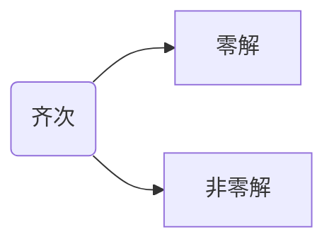
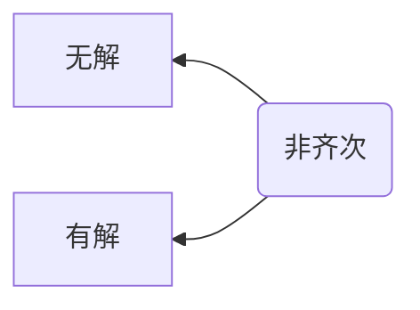

---

---

# 解释如下概念
- 入门对比
  1. 齐次vs非齐次
  1. 线性vs非线性
  1. 微分vs求导vs积分
  1. 方程组vs矩阵乘法
- 齐次线性方程组
  1. 永远存在**零解**
  1. 基础解系vs通解
  1. 存在**非零解**↔︎A不满秩
  2. r(A) + η的数量 = n (x的列有多长)
- 非齐次线性方程组
  1. Ax=b 的2个解**互减**，即 **ξ₁-ξ₂** 是 <ruby>Ax=0<rt>导出组</rt></ruby> 的解
  2. Ax=b 的解 ξ+kη ，其中 k∈R，η是Ax=0的解
  3. Ax=b 有解 ↔︎ rA = r<ruby>[A,b]<rt>增广矩阵</rt></ruby>
  4. Ax=b 无解 ↔︎ rA = r[A,b]-1

# 入门对比

## 齐次vs非齐次
所有x的阶数/次方相同

1. **k**次齐次函数： f(λx₁+λx₂+...+λxₙ)=**λᵏ** · f(x₁+x₂+...+xₙ)
   - 0次齐次函数 $\frac{y}{x}$=$\frac{λy}{λx}$=**λ⁰**·$\frac{y}{x}$
   - 1次齐次函数 = 线性函数 f(x₁,x₂,x₃...)=k₁x₁+k₂x₂+k₃x₃=**λ¹**·f(x₁,x₂,x₃...)
   - 2次齐次函数 = 二次型 = 双线性  
     f(x,y) = 类(x+y)² = ax²+bxy+cy² = **λ²**·f(x,y)
     f(x₁,x₂,x₃...)=**ΣΣ**kᵢⱼ xᵢ xⱼ=**λ²**·f(x₁,x₂,x₃...)

1. 齐次方程: 齐次函数=0
   **非**齐次方程: 齐次函数=b=**x⁰**

1. 联立这些(非)齐次方程，得(非)齐次方程组

## 线性vs非线性
1. 线性: 加性，<ruby>齐次<rt>比例</rt></ruby>性
1. 齐次非线性方程
   $ F(x, y, y', y'', \ldots, y^{(n)}) = 0 $
   这里 $ F $ 是一个非线性函数，$ y $ 是未知函数，$ y', y'', \ldots, y^{(n)} $ 分别表示 $ y $ 的一阶、二阶、……、$ n $ 阶导数。
   1. **一阶**齐次非线性**微分**方程：
      $ y' = f\left(\frac{y}{x}\right) $
      这是一个常见的齐次非线性方程形式，其中 $ f $ 是一个非线性函数。

   2. 二阶齐次非线性微分方程：
      $ y'' + y^3 = 0 $
      这里 $ y'' $ 表示 $ y $ 的二阶导数，$ y^3 $ 是 $ y $ 的三次幂，这是一个非线性项。

   3. 更高阶齐次非线性微分方程：
      $ y''' + (y')^2 + y^4 = 0 $
      这个方程包含 $ y $ 的三阶导数、一阶导数的平方以及 $ y $ 的四次幂，都是非线性项。

## 微分vs求导vs积分
1. 微分dx，求导y'=$\frac{dy}{dx}$，积分∫x dx
2. **微分**方程(即有**求导**)
   1. 微分方程中的齐次
   此处的“齐次”通常指的是方程中**没有自由项**（即不依赖于未知函数及其导数的项）。如：y′′+ *p(x)* y′+ *q(x)* y=0

TODO 待复习：微分定义

## 方程组vs矩阵乘法
线性方程组 与 矩阵乘法Ax=b 可以互相转换

# 齐次线性方程组
## 永远存在零解
非齐次 不存在 零解，因为Ax=b，右侧不是0，而是b；所以非齐次会有“无解”的可能，而齐次至少有“零解”

## 基础解系vs通解
1. **解**，或**解向量**，如：
$$
η=
\begin{bmatrix}
v_1 \\
v_2 \\
v_3 \\
\vdots
\end{bmatrix}
$$
其中v1~vn为具体的数值
与x1~xn一一对应

2. **基础解系**，或**基向量**，由一系列线性无关的*解向量*组成，如：η₁,η₂,η₃,...
   - 线性无关，是保证 η₁,η₂,η₃... 始终是极大线性无关组，即不能有重复解

3. **通解**，因为存在非零解，所以A不满秩，造成x1~xn内有一部分自由项。如：
$$
\vec{x}=f_3
\begin{bmatrix}
v_{1}=a \\
v_{2}=b \\
v_3=1 \\
v_4=0 \\
\end{bmatrix}
+ f_4
\begin{bmatrix}
c \\
d \\
0 \\
1 \\
\end{bmatrix}
$$
其中有2个自由项x3,x4，对应f3,f4(也可以换成i,j)
有通解，也表示**解**在**约束**条件下，是**无穷尽**的。解不唯一

## 存在非零解↔︎A不满秩↔︎rA<n
系数矩阵 $A_{m×n}$
- A满秩，此时x1~xn不自由，只有η=0的零解
- A不满秩，此时x1~xn有自由项，存在 **n-rA** 个非零解。**解**与**系数矩阵的秩(约束)**，呈 **此消彼长**，即rA越大，对解的约束越多，x1~xn越不自由，解η的数量就越少。

复习书上写了些废话：
- m<n，横长方形的A，则Ax=0**必有**非零**解**
- ~~m=n，A为方阵，行列式|A|=0~~ (只有方阵，才能计算行列式、逆矩阵)

# 非齐次线性方程组
## Ax=b 有解 ↔︎ rA = r[A,b]
b可由A的列向量线性表出
新加入的b列，不会扰乱原有的秩序

## Ax=b 无解 ↔︎ rA = r[A,b]-1
假如A化成最简型，那么方程组的最后一个方程会是 0=b，这样就无解了。
就因为加入的一列，所以就解不出来了。那就应该是增秩了。